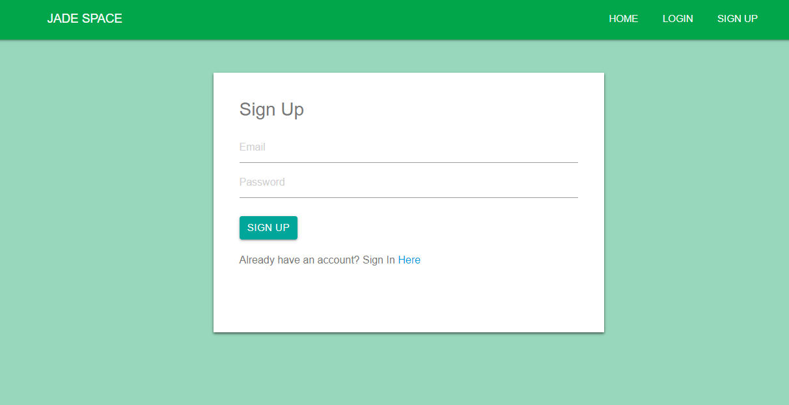
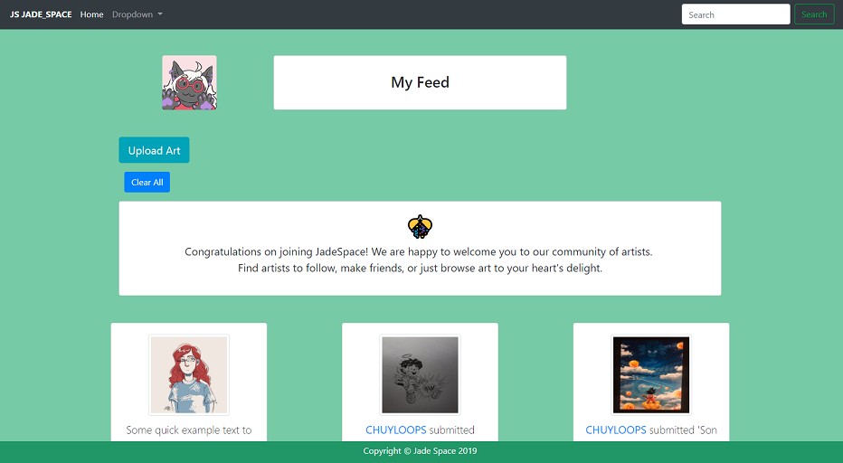

# JADE_SPACE

JADE_SPACE provides an art-oriented space for artists and art appreciators.
Users will be able to upload artwork, build networks, and potentially facilitate bartering/selling of art-related goods. Users share and curate contact information at their own discretion to take advantage of JADE_SPACE.

It is built on node.js for the backend and jquery on the front end.

## Dependencies

* NPM aws-sdk, bcryptjs, busboy, busboy-body-parser, connect-busboy, dotenv, express, express-session, mysql, mysql2, passport, passport-facebook, passport-google-oauth, passport-local, passport-twitter, sequelize

* (DEV Dependency) nodemon

This application is live on: https://frozen-retreat-71072.herokuapp.com/
## Pages

Viewers will first see the JADE_SPACE home page, an introduction to what the application can offer.

Viewers are prompted to sign-up or login.

Upon creating account details, users now have access to the 'Feed' page. User will be able to receive notifications about the users they follow, and remove the "notifs" with the 'Clear All' button.

